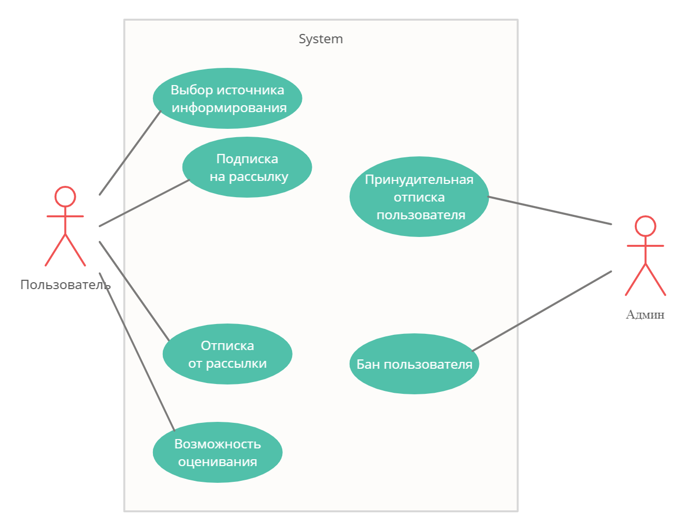

# Прецеденты использования
В системе действуют следующие лица: пользователь и администратор

### Пользователь
* подписка на рассылку
* выбор источника информирования
* возможность ставить отметку нравится/не нравится
* отписка от рассылки

### Администратор

* принудительно отписывает пользователей
* бан пользователей

## Диаграмма прецедентов использования

## Спецификации потоков событий

1. Спецификации прецедентов использования **пользователя**:

| Прецедент | Подписка на рассылку |
| --- | --- |
| Краткое описание | *Пользователь* подписывается на рассылку в Telegram |
| Действующие лица | *Пользователь* |
| Предусловия | Желание собрать всю информацию в одном месте |
| Основной поток | *Пользователь* использует команду "/subscribe" |
| Альтернативные потоки | *Пользователь* прочитал описание бота и решил не подписываться, следовательн никаких взаимодействий между пользователем и ботом не произойдёт |
| Постусловия | Если *пользователь* выбирает подписку, то ему предлагается выбор источников информации, с которых будет собираться информация |

| Прецедент | Выбор источника информирования |
| --- | --- |
| Краткое описание | *Пользователь* выбирает интересные ему новости |
| Действующие лица | *Пользователь* |
| Предусловия | Желание получать информацию с конкретных источников |
| Основной поток | *Пользователь* выбирает источники, с которых он хочет получать информацию |
| Альтернативные потоки | *Пользователь* не выбрал ни одного источника информации, соответственно он будет получать всё сразу |
| Постусловия | Если *пользователь* происходит подписка пользователя на выбранные им источники. Дальнейшая информация будет приходить в связи с его выбором |

| Прецедент | Возможность оценивания |
| --- | --- |
| Краткое описание | *Пользователь* ставит нравится/не нравится просмотренным новостям |
| Действующие лица | *Пользователь* |
| Предусловия | Внезапное желание оценить новость |
| Основной поток | *Пользователь* нажимает на подходящие emoji |
| Альтернативные потоки | *Пользователь* проигнорировал оценивание. Ничего не произойдёт |
| Постусловия | Если *пользователь* оценивает новость, у него скорее всего поднимается настроение |

| Прецедент | Отписка от рассылки |
| --- | --- |
| Краткое описание | *Пользователь* отписывается от рассылки бота в Telegram |
| Действующие лица | *Пользователь* |
| Предусловия | Нежелание более терпеть этого несчастного бота |
| Основной поток | *Пользователь* использует команду "/unsubscribe" |
| Альтернативные потоки | *Пользователь* взгрустнул, что ему снова придётся собирать новости самостоятельно, и передумал отписываться |
| Постусловия | Если *пользователь* отписывается от рассылки бота, он больше не получает информацию |

| Прецедент | Принудительная отписка пользователей |
| --- | --- |
| Краткое описание | *Администратор* отписывает подписчиков бота |
| Действующие лица | *Администратор* |
| Предусловия | Желание отписать пользователя от рассылки |
| Основной поток | *Администратор* выбирает пользователя из списка и отписывает его |
| Альтернативные потоки | *Администратор* вспомнил, что пользователь - его давний друг и решил не отписывать его. |
| Постусловия | *Пользователь* более не получает новости от бота |

| Прецедент | Принудительная отписка пользователей |
| --- | --- |
| Краткое описание | *Администратор* банит подписчиков бота |
| Действующие лица | *Администратор* |
| Предусловия | Желание ограничить доступ к боту конкретным людям |
| Основной поток | *Администратор* выбирает пользователя из списка и банит его |
| Альтернативные потоки | *Администратор* вспомнил, что пользователь - его давний друг и решил не банить его. |
| Постусловия | *Пользователь* более не получает новости от бота и не может подписаться обратно |